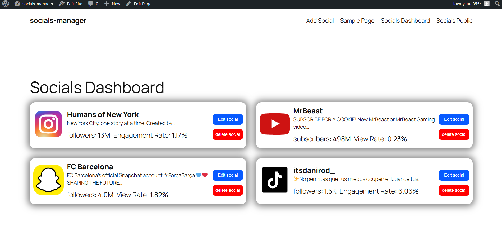
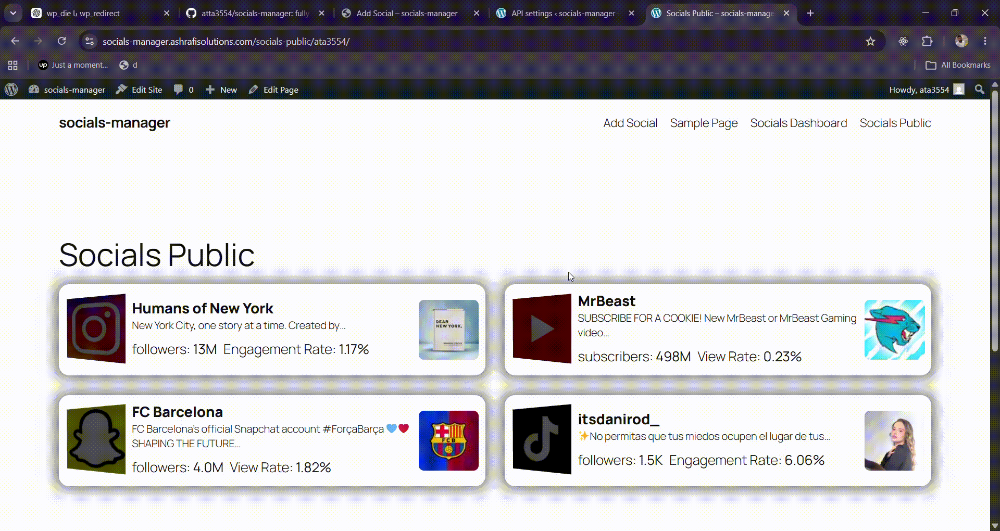

# Social Manager

Theme-independent WordPress plugin for collecting, validating, displaying, and managing users' social accounts from a single dashboard.

Social Manager lets site members submit their social profiles, fetches profile metadata through selected API providers, stores the validated accounts in user meta, and renders both private management pages and public social profile pages.

## Live Demo & Preview

Use the live demo pages created by the plugin after activation:

- User dashboard: `/socials-dashboard`
- Public social directory/profile page: `/socials-public`
- Public user profile route: `/socials-public/{username}`

Dashboard preview:



Public page preview:



## Features

- Frontend social account submission form.
- User dashboard for viewing, editing, and removing submitted socials.
- Public social profile pages for users.
- Archive page for users who have active social accounts.
- Provider-based validation and metadata fetching.
- Official OAuth providers for Instagram and YouTube.
- Third-party provider support through Apify and SerpApi.
- Avatar sideloading into the WordPress media library.
- Engagement/view/like rate calculation depending on the platform.
- Admin UI for selecting enabled socials, providers, API keys, actor IDs, and account limits.
- Automatic creation of dashboard and public pages on activation.

## Supported Socials & Providers

| Social | Official | Apify | SerpApi |
| --- | --- | --- | --- |
| Instagram | Yes | Yes | Yes |
| YouTube | Yes | Yes | Yes |
| TikTok | No | Yes | No |
| Snapchat | No | Yes | No |
| Google Maps | No | No | Yes |

## Requirements

- WordPress installed and running.
- PHP 8.0 or newer.
- Pretty permalinks enabled for the `/socials-public/{username}` route.
- cURL/WordPress HTTP API access from the server.
- API credentials for the provider(s) you enable.
- Linux deployments must keep directory casing aligned with namespaces, for example `inc/Providers`, `inc/Services`, and `inc/Utils`.

## Installation

1. Copy the plugin folder into `wp-content/plugins/socials-manager`.
2. Activate **Social manager** from the WordPress plugins screen.
3. The plugin creates two pages automatically:
   - `socials-dashboard`
   - `socials-public`
4. Go to **Socials manager > API settings**.
5. Select the socials you want to support.
6. Choose one provider for each social.
7. Save provider credentials and settings.

## Admin Setup

Open **Socials manager > API settings** and configure:

- Desired social platforms.
- Provider per social platform.
- Apify API key and actor IDs when using Apify.
- SerpApi API key when using SerpApi.
- Official app client ID, client secret, and redirect URI when using Official providers.
- Whether users can add one or multiple accounts per platform.

## Official Instagram Setup

Official Instagram support is treated as a complete first-party OAuth flow.

Use the **Official** provider for Instagram when you want users to connect accounts through Meta's official OAuth flow instead of submitting a profile URL for scraping/search-based validation.

High-level setup:

1. Create or open your Meta app.
2. Enable the Instagram/Facebook Graph API features required by your app.
3. Add the redirect URI shown in **Socials manager > API settings > Instagram > Official**.
4. The redirect URI format is:

   ```text
   https://example.com/wp-json/socials-manager/v1/oauth/callback/instagram
   ```

5. Save the Instagram client ID and client secret in the plugin settings.
6. Make sure the Instagram account being connected is eligible for Graph API access and is connected to the required Facebook page/business context.

The plugin handles:

- OAuth URL generation.
- State storage and validation.
- OAuth callback handling through the WordPress REST API.
- Access token exchange.
- Instagram account lookup.
- Recent media lookup.
- Engagement rate calculation.
- Saving the final social account data to the current user's social list.

## Official YouTube Setup

Use the **Official** provider for YouTube when you want users to connect their channel through Google OAuth.

1. Create a Google Cloud OAuth client.
2. Add the redirect URI shown in the plugin settings.
3. The redirect URI format is:

   ```text
   https://example.com/wp-json/socials-manager/v1/oauth/callback/youtube
   ```

4. Save the YouTube client ID and client secret in **Socials manager > API settings**.

## Apify Setup

Apify is available for:

- Instagram
- YouTube
- TikTok
- Snapchat

To use Apify:

1. Add your Apify API key.
2. Select Apify as the provider for the desired social.
3. Add the actor ID for that social.
4. Save settings.

The selected actor must return the fields expected by the plugin's provider class for that social.

## SerpApi Setup

SerpApi is available for:

- Instagram
- YouTube
- Google Maps

To use SerpApi:

1. Add your SerpApi API key.
2. Select SerpApi as the provider for the desired social.
3. Save settings.

## Shortcodes

| Shortcode | Description |
| --- | --- |
| `[sm_submit_socials_form]` | Renders the frontend social submission form. |
| `[sm_user_socials_dashboard_page]` | Renders the logged-in user's social dashboard. |
| `[sm_user_socials_public_page]` | Smart public page handler. Shows archive when no username is present and single profile when a username is supplied. |
| `[sm_archive_social_owners]` | Shows users who have at least one saved social account. |
| `[sm_social_owners_socials]` | Shows one user's public social profile. |

## Generated Pages

On activation, the plugin creates:

| Page | Slug | Shortcode |
| --- | --- | --- |
| Socials Dashboard | `socials-dashboard` | `[sm_user_socials_dashboard_page]` |
| Socials Public | `socials-public` | `[sm_user_socials_public_page]` |

The rewrite rule also supports:

```text
/socials-public/{username}
```

## Stored Data

User social accounts are stored in user meta:

```text
sm_user_socials
```

Main plugin options include:

- `sm_selected_social`
- `sm_selected_api_provider`
- `sm_api_keys`
- `sm_actor_ids`
- `sm_official_datas`
- `sm_allowed_socials_count`
- `sm_default_avatar_attachment_id`

## Extension Points

The plugin exposes filters for supported socials, provider socials, request bodies, field maps, fetched data, engagement rates, and template paths.

Examples:

- `sm_supported_socials`
- `sm_apify_socials`
- `sm_serapi_socials`
- `sm_official_socials`
- `sm_generate_apify_instagram_request_body`
- `sm_generate_official_request_body`
- `sm_instagram_fields_map`
- `sm_youtube_fields_map`

## Notes

- API credentials are stored in WordPress options.
- Users must be logged in to submit or manage socials.
- Admin settings require `manage_options`.
- Dashboard edit/remove requests are nonce-protected.
- OAuth callbacks are registered under the `socials-manager/v1` REST namespace.
